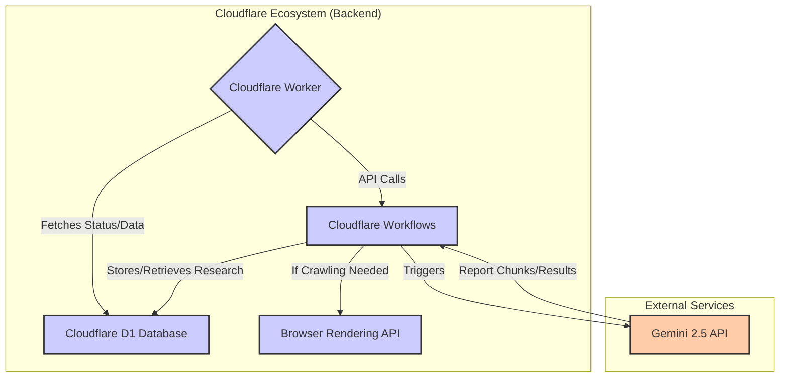
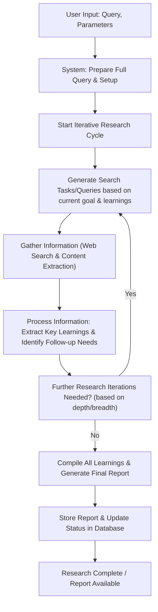

# workers-research

**A serverless, Cloudflare Workers-based Deep Research Agent powered by Google Gemini 2.5.**

[](https://github.com/G4brym/workers-research/stargazers)
[](https://github.com/G4brym/workers-research/blob/main/LICENSE)

## ✨ Features

- **In-depth Research with Google Gemini 2.5:** Leverages Google's latest models for high-quality research reports.
- **Serverless on Cloudflare:** Built with Workers and Workflows for scalability, reliability, and cost-effectiveness.
- **Intuitive Dashboard:** Manage and view research via a Hono/JSX web interface.
- **Simplified Architecture:** Gemini 2.5's large context window removes the need for prompt compression, enhancing report quality.
- **AutoRAG Integration:** Allows the system to perform research using Cloudflare AI's AutoRAG feature, which queries against a pre-indexed dataset. This can be used as an alternative or in conjunction with standard web browsing research. The AutoRAG feature is invoked when an `autorag_id` is provided with the research request.

## 🚀 Inspiration and Acknowledgements

Inspired by [dzhng's deep-research](https://github.com/dzhng/deep-research). Thank you to dzhng for the original concept. `workers-research` adapts this for the Cloudflare ecosystem.

## 💡 Key Differences from Original Deep-Research

- **Cloudflare Native:** Runs on Cloudflare Workers and Workflows, unlike the Node.js/Docker original.
- **Enhanced Reliability:** Uses Cloudflare Workflows for robust multi-step research.
- **Simplified & Efficient:** Leverages Gemini 2.5's large context window, omitting prompt compression for a streamlined design and potentially better reports.
- **Accessible Crawling:** Utilizes Cloudflare's Browser Rendering (available on the free Workers plan).

## 🔍 Use Cases

- **Academic Research:** Quickly gather information and insights for academic papers, theses, and research projects.
- **Market Analysis:** Research industry trends, competitors, and market dynamics for business decisions.
- **Content Creation:** Generate comprehensive research for blog posts, articles, and educational content.
- **Product Development:** Explore user needs, technical solutions, and industry standards for new products.
- **Educational Projects:** Help students gather information on complex topics for projects and assignments.

## 🛠️ Technology Stack

- **Cloudflare Workers:** Core runtime environment.
- **Cloudflare Workflows:** Manages reliable research execution.
- **Cloudflare D1 Database:** Serverless SQL for research data.
- **Browser Rendering:** Web crawling (free tier available).
- **Google Gemini 2.5:** Advanced language model for reports.
- **Cloudflare AI Gateway (Optional):** Proxy for AI requests (caching, management).
- **Hono:** Lightweight web framework for dashboard and API.
- **workers-qb:** Query builder for Cloudflare D1.

## 🏗️ Architecture Overview



### Research Workflow Diagram

The following diagram illustrates the detailed workflow of the research agent when processing a request:



## 🚦 Getting Started

Follow these steps to set up and run `workers-research` on your Cloudflare account:

### Setup Steps

1. **Clone the Repository:**
   ```bash
   git clone git@github.com:G4brym/workers-research.git
   ```

2. **Install Dependencies:**
   ```bash
   npm install
   ```

3. **Cloudflare Login:**
   Authenticate with your Cloudflare account using Wrangler:
   ```bash
   wrangler login
   ```

4. **Create a Cloudflare D1 Database:**
   Create a D1 database in your Cloudflare dashboard or using Wrangler:
   ```bash
   wrangler d1 create workers-research
   ```
   **Important:** Replace `"replace-me"` in your `wrangler.toml` file with the `database_id` output from the command above.

	Database migrations are applied automatically.

5. **Deploy to Cloudflare Workers:**
   Deploy your worker to Cloudflare:
   ```bash
   wrangler deploy
   ```
   This will deploy your worker to `workers-research.{your-user}.workers.dev` (or your custom domain if configured).

6. **Set up API Keys:**
   - **Google AI Studio API Key:** Obtain from [https://aistudio.google.com](https://aistudio.google.com).
   - Upload API Keys into workers:
     ```bash
     npx wrangler secret put GOOGLE_API_KEY
     ```

7. **(Optional) Configure Cloudflare AI Gateway:**
   - Create an AI Gateway in your Cloudflare account dashboard.
   - Configure the gateway with your preferred settings.
   - Set the required environment variables:
     ```bash
     npx wrangler secret put AI_GATEWAY_NAME
     npx wrangler secret put AI_GATEWAY_ACCOUNT_ID
     ```
   - If your gateway has authentication enabled, also set the API key:
     ```bash
     npx wrangler secret put AI_GATEWAY_API_KEY
     ```

8. **Access the Dashboard:**
   Open your deployed worker URL (e.g., `https://workers-research.{your-user}.workers.dev`) in your browser to access the research dashboard.

## ✍️ Usage

1. **Create a New Research:**
   - On the dashboard homepage, you'll see a "Create New Research" section.
   - Enter your research query, desired depth, and breadth.
   - Click "Continue with creation".

2. **Answer Follow-up Questions:**
   - The application will generate follow-up questions to clarify your research intent.
   - Answer these questions to refine the research direction.
   - Click "Create new Research" to start the research workflow.

3. **Monitor Research Status:**
   - You can track the status of your researches on the dashboard.
   - Researches in progress will be marked as "Running".
   - Completed researches will be marked as "Complete".

4. **Read Research Reports:**
   - Once a research is complete, a "Read" button will appear next to it.
   - Click "Read" to view the generated research report in a nicely formatted HTML page.

5. **Re-run Researches:**
   - If you want to re-run a previous research, click the "🔄" button next to the research entry. This will create a new research based on the same query and parameters.

## 📊 Performance & Limitations

- **Research Time:** Most researches complete within 5-10 minutes, depending on complexity.
- **Research Depth:** Configure depth from 1-5, with higher values producing more comprehensive reports.
- **API Limits:** Be aware of Cloudflare and Google Gemini API limits when running multiple researches. Browser Rendering on the Workers Free plan is limited to 10 minutes of usage per day, sufficient for most research tasks.

## 💬 Community & Support

- **[GitHub Issues](https://github.com/G4brym/workers-research/issues):** Report bugs or suggest features
- **[Discussions](https://github.com/G4brym/workers-research/discussions):** Ask questions and share ideas
- **[Discord Community](https://discord.gg/example):** Join our community for real-time help

## 🖼️ Screenshots

Home page


New Research


Follow up questions


Reading a report


## 📜 License

This project is licensed under the MIT License - see the [LICENSE](LICENSE) file for details.
